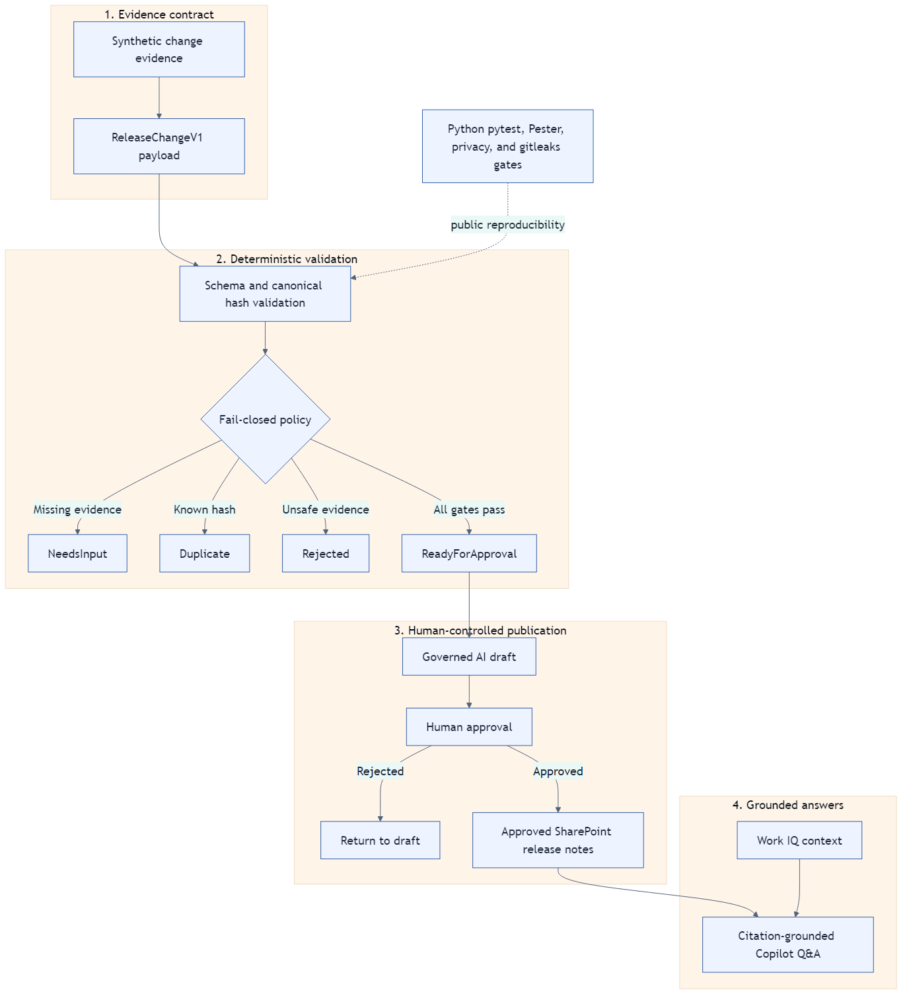

# Governed Release Copilot

**Evidence in. Approval enforced. Trusted answers out.**

Governed Release Copilot is a synthetic public reference for turning business
application change evidence into a controlled release story:

**Change Evidence → AI Draft → Human Approval → SharePoint Knowledge → Agent
Q&A with Citation**

The repository proves the contract and fail-closed governance behavior without
requiring a Microsoft tenant or exposing organization data. The exact
claim-to-evidence mapping is maintained in
[docs/evidence-matrix.md](docs/evidence-matrix.md).

## Problem

Workflow, form, SharePoint, and database changes often leave evidence in
different tools. Manual release notes can then drift away from the change that
was tested. This reference addresses that risk with a normalized
[`ReleaseChangeV1` contract](schema/ReleaseChangeV1.schema.json), a
[canonical hash validator](src/governed_release_copilot/validator.py), and a
[deterministic decision policy](src/governed_release_copilot/policy.py).

## What The Public Reference Proves

| Claim | Evidence |
|---|---|
| Valid evidence reaches `ReadyForApproval`. | [Policy test](tests/test_policy.py) and [valid sample](samples/valid.json) |
| Missing evidence becomes `NeedsInput`. | [Policy test](tests/test_policy.py) and [missing-fields sample](samples/missing-fields.json) |
| A previously accepted canonical hash becomes `Duplicate`. | [Policy test](tests/test_policy.py) and [duplicate sample](samples/duplicate.json) |
| Invalid input, hash mismatch, failed tests, or unavailable rollback fail closed. | [Validator tests](tests/test_validator.py), [policy tests](tests/test_policy.py), and [rejected sample](samples/rejected.json) |
| Public content is scanned for tenant data and secrets. | [Privacy scanner](scripts/privacy_scan.py), [scanner tests](tests/test_privacy_scan.py), and [CI workflow](.github/workflows/verify.yml) |
| Video narration and captions are frozen and checked for parity. | [Video manifest](docs/video/README.md) and [documentation tests](tests/test_docs.py) |
| Validation tools are exposed as Model Context Protocol (MCP) tools for Microsoft 365 Copilot. | [MCP server](src/governed_release_copilot/mcp_server.py), [MCP tests](tests/test_mcp_server.py), and [appPackage](appPackage) |

## Governance Model

```text
ReadyForApproval  complete evidence, valid schema and hash, passed tests
NeedsInput        required evidence is absent or a test has not run
Duplicate         canonical changeHash already exists in the registry
Rejected          invalid schema/hash, failed tests, or no rollback
```

No public decision publishes content. `ReadyForApproval` means only that a
human may review the proposed AI draft. The
[architecture diagram](docs/architecture.png) shows the approval and approved
knowledge boundaries, while [DECISIONS.md](DECISIONS.md) records the policy
choices.

## Architecture



The editable source is [docs/architecture.mmd](docs/architecture.mmd). Work IQ
is shown as a context source for citation-backed Q&A; approved SharePoint
release notes remain the publication boundary. Live tenant proof is explicitly
listed as an owner action in [DECISIONS.md](DECISIONS.md).

## Run Locally

Prerequisites:

- Python 3.12
- gitleaks 8.30.1

```powershell
python -m pip install -r requirements-dev.txt -e .
python -m pytest -q
python scripts/verify.py
```

Evaluate the synthetic samples:

```powershell
grc-validate samples/valid.json
grc-validate samples/missing-fields.json
grc-validate samples/rejected.json
```

The optional duplicate registry is a JSON array of accepted hashes:

```powershell
grc-validate --registry accepted-hashes.json samples/duplicate.json
```

Run the Model Context Protocol (MCP) server:

```powershell
python src/governed_release_copilot/mcp_server.py
```

## Submission Package

- [Architecture source](docs/architecture.mmd) and
  [rendered PNG](docs/architecture.png)
- [Evidence matrix](docs/evidence-matrix.md)
- [Submission-form draft](docs/submission.md)
- [Eight-scene narration and captions](docs/video/README.md)
- [Synthetic payloads](samples)
- [GitHub Actions verification](.github/workflows/verify.yml)
- [Declarative Agent package (manifest, agent configuration, API plugin, logo)](appPackage)
- [Python Model Context Protocol (MCP) server](src/governed_release_copilot/mcp_server.py) and [Toolkit config](.vscode/mcp.json)

## AI Production Transparency

The product proof is the schema, policy, tests, CI, and Microsoft architecture.
Gemini may be used to generate narration from the frozen public script. Veo may
be used only for optional six-second intro and outro polish based on sanitized
title cards. Neither tool generates product UI, test evidence, or claims about
tenant behavior. The binding decisions are recorded in
[DECISIONS.md](DECISIONS.md).

## Safety Boundary

All committed examples are synthetic. The
[privacy scanner](scripts/privacy_scan.py) rejects email or UPN shapes,
canonical GUIDs, tenant domains, internal hostnames, real-looking ticket IDs,
credentials, private keys, and absolute user paths. CI also runs gitleaks over
the working tree and all fetched Git refs through
[scripts/verify.py](scripts/verify.py).

## License

[MIT](LICENSE)
